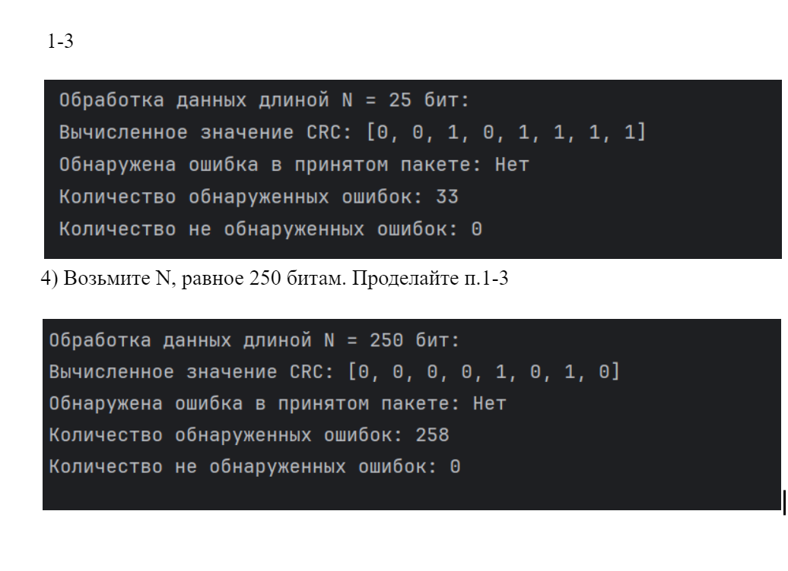

3. Задание для выполнения практической работы
   В рамках данной работы студенты должны научиться вычислять CRC последовательности, а также на их основании детектировать ошибки.
   Порядок выполнения работы:

Вариант 

1-3

4) Возьмите N, равное 250 битам. Проделайте п.1-3

4. Контрольные вопросы
1) Для чего в мобильных сетях используются CRC-проверки?
   CRC (циклический избыточный код) используется в мобильных сетях для проверки целостности данных и обнаружения ошибок, возникающих в процессе передачи. В мобильных сетях, где данные могут быть искажены из-за шума, помех или других факторов, CRC помогает гарантировать, что данные, полученные на приемной стороне, не были изменены или повреждены при передаче.
   Обнаружение ошибок: CRC позволяет быстро и эффективно проверять данные на наличие ошибок. Если остаток от деления данных на CRC-полином не равен нулю, значит, данные были повреждены.
   Целостность данных: При передаче данных по сети CRC позволяет приемной стороне убедиться в том, что данные не были изменены или потеряны, а передача прошла без ошибок.
   Снижение ошибок: Использование CRC-проверок в мобильных сетях снижает количество неправильных данных, что способствует повышению качества связи.
2) Что такое порождающий полином?
   Порождающий полином (или генераторный полином) — это полином, который используется для вычисления CRC. Он определяет математическую основу для деления данных на побитовые значения и получения остатка. Порождающий полином используется как делитель при вычислении CRC.
   Формат: Порождающий полином обычно записывается в виде многочлена. Например, для полинома G = x^7 + x^6 + x^5 + x^4 + x^3 + x + 1это означает, что коэффициенты при степенях x7,x6,…x^7,,… равны 1, а остальные равны 0. В бинарном представлении это будет: 11111011.
   Роль в CRC: Порождающий полином используется в процессе деления данных на биты и получения остатка от деления. Этот остаток (или CRC) добавляется к данным, чтобы обеспечить проверку целостности на приемной стороне.
   Пример: Для полинома G = x^7 + x^6 + x^5 + x^4 + x^3 + x + 1(или в бинарной форме 11111011), процесс вычисления CRC выполняется путем побитового деления данных на этот полином.
3) Как вычислить CRC для пакета с данными?
   Вычисление CRC для пакета с данными включает несколько шагов. Процесс заключается в делении данных на порождающий полином с получением остатка. Вот шаги для вычисления CRC:
   Добавление нулей: Для начала необходимо добавить к данным количество нулей, равное степени полинома. Например, для полинома G = x^7 + x^6 + x^5 + x^4 + x^3 + x + 1 (степень 7), добавляется 7 нулей к данным.
   Деление данных на полином: Данные (с добавленными нулями) делятся на порождающий полином с использованием операции побитового XOR. Это деление выполняется побитово, начиная с самого старшего бита.
   Получение остатка: После деления остается остаток (CRC). Этот остаток добавляется к исходным данным (передаваемым данным), и на приёмной стороне этот остаток используется для проверки целостности.
   Алгоритм для вычисления CRC:
   Шаг 1: Дополните данные нулями, добавив количество нулей, равное степени полинома. Например, для полинома степени 7 добавьте 7 нулей к данным.
   Шаг 2: Начинайте деление данных на полином. Для каждого бита данных:
   Если старший бит данных равен 1, то выполняйте побитовый XOR данных с полиномом.
   Сдвигайте данные влево (отбрасывайте старший бит и добавляйте новый бит из данных).
   Шаг 3: После завершения деления остаток будет CRC. Этот остаток — это и есть контрольная сумма, которая добавляется к данным.
   Шаг 4: На приёмной стороне пакет данных с добавленным CRC проверяется, выполняя ту же операцию деления. Если остаток равен нулю, значит, данные не были повреждены.
   Пример вычисления CRC (для полинома G=x7+x6+x5+x4+x3+x+1
   Предположим, что у нас есть данные 101100110110011011001 и полином G=11111011G = 11111011G=11111011 (степень 7). Процесс вычисления CRC будет следующим:
   Добавляем к данным 7 нулей: 1011001→1011001000000001011001 \rightarrow 1011001000000001011001→101100100000000.
   Начинаем делить данные на полином:
   XOR первого набора данных с полиномом.
   Сдвигаем данные и повторяем процесс.
   После завершения деления получаем остаток, который является CRC.
   Таким образом, вычисленный CRC добавляется к исходным данным для передачи по каналу, а на приёмной стороне CRC используется для проверки целостности данных.
